# History of the NBA

History of the NBA is a website for people who are intrested in the NBA. This site specifically mentions the creation of basketball and the creation and rise of the NBA. It also has a section dedicated to people that have impacted the game of basketball.

The live link can be found here - https://uloe-g.github.io/History-Of-NBA/

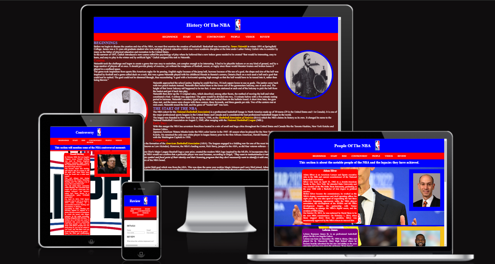

## Features
This section goes over the different parts of this project. An explaination will be given of what the features provides the user.

### Existing Features
- __Navigation Bar__

  -This is identical on all six pages and includes links to the Beginning, Start, Rise, Players, Video and Review pages.

  -This allows user to easily navigate from page to page, section to section across all devices.

- __Beginnings Section__

  -The beginning section is about the creation of basketball.

  -It mentions who created it, where it was create and why it was created.
  
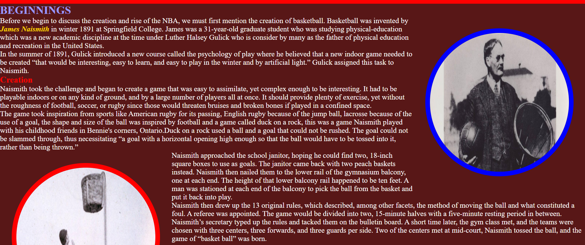

- __Start Section__
  
  -This section is about the creation of the NBA.

  -It mentions the early days of the NBA and the challenges it faced.

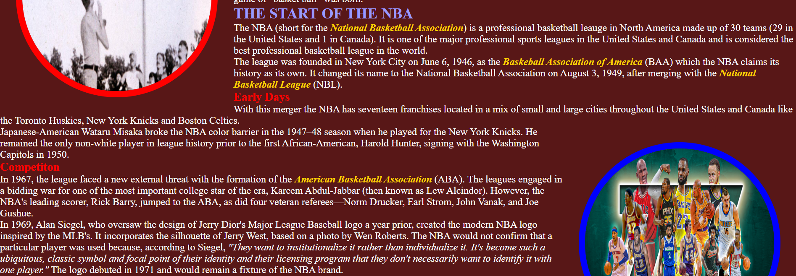
  
- __Rise Section__
  
  -This section discusses the rise of the NBA 
  
  -It talkes about the move and some of the players that helped make the NBA a sustainable leauge.

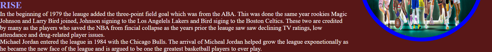

- __Controversy Section__
  
  -This section talks about some controversial moments that happened in the NBA.

  -It describes what happened and how the NBA or the law solved them

- __People Section__

  -This section shows users the history of som of the NBA most famous and important people.

  -It describes how they got there and the legacies they have achieved

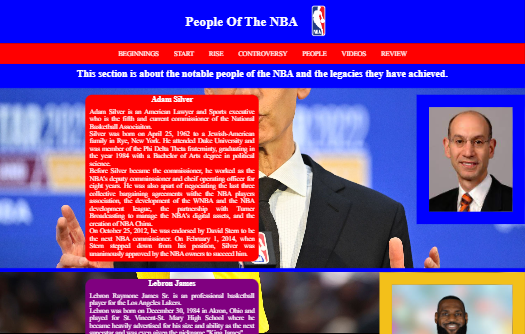

- __Video Section__

  -This section contains videos of moments and people mentioned in the controversy page and people page.

  -It adds extra information on the situations and showcases their talents.

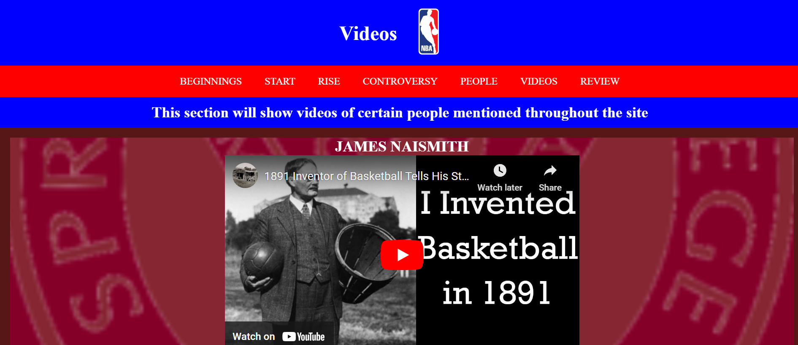

- __Review Section__

  -This section gives the user the ability to critic the webiste after going through it.

  -It allows them to state everything they liked and dislike whilst on this website.

  -It also give them the ability to give there own opinions on how this website can be improved.

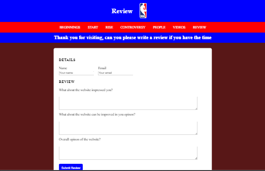

- __Footer__
  
  -The footer section includes links to various social media platforms the NBA is apart of.

  -This is to give the user easier and quicker access to some of the platforms the NBA is apart of.

## Design

### Colors

- The general layout colors were taking from the NBA logo. This was done since this is about the NBA the colors should match the subject.

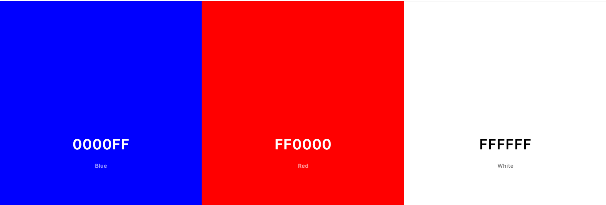

- The background color is brown because that is the color of the Springfield college logo which is where basketball was said to be invented.

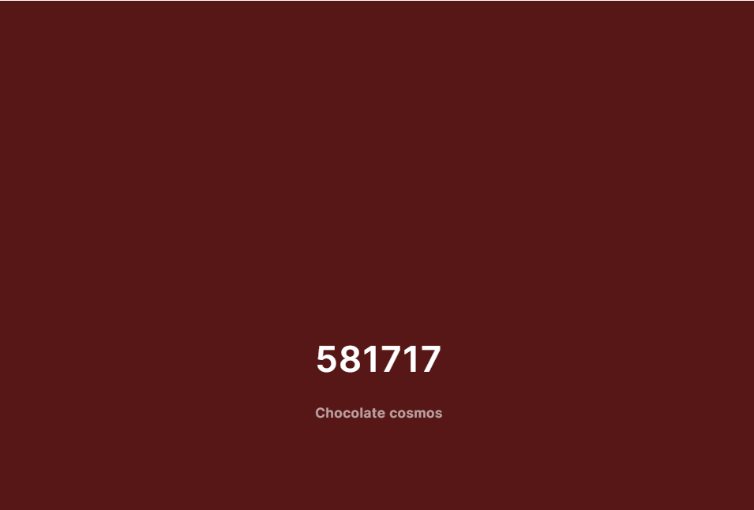

- In the controversey section each color was meant to highlight aspects surrounding the topic being mentioned.

  - The red for Donald Sterling was done because the situation happened with the LA Clippers, which have red on their logo.

  - The Grey for the dress code was done because of the suit in the image.

  - The Blue for the gun incident was done because the player that caused it played for the washington wizards, which wear a blue jersey.

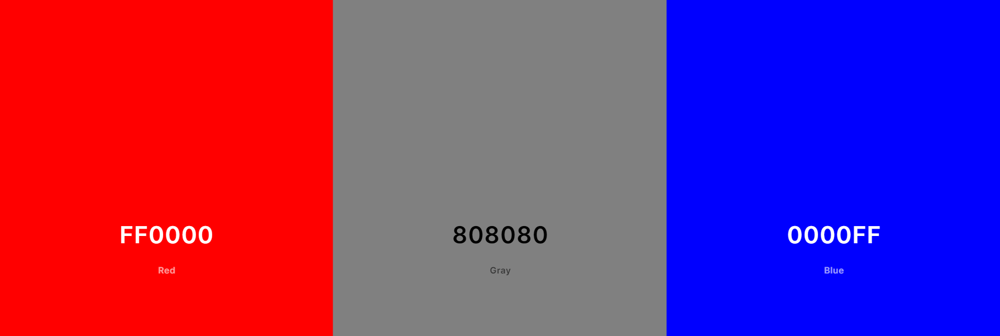

- The same can be said for the peoples section. Each color represents something important.

  - The Blue and Red for Adam silver is there because he the the comissioner of the NBA which colors have blue and red in them.

  - The Purple and Gold for Lebron James is there because right now he plays for the LA Lakers which primary colors are purple and gold.

  - The Black and Red for Micheal Jordan was done because those are colors on the Chigaco bulls. Red and white was also an option but the white did blend well with the background.

  - Yellow and Blue was done for Steph Curry because he currently plays for the Golden State Warriors, which have a blue and yellow color to them.

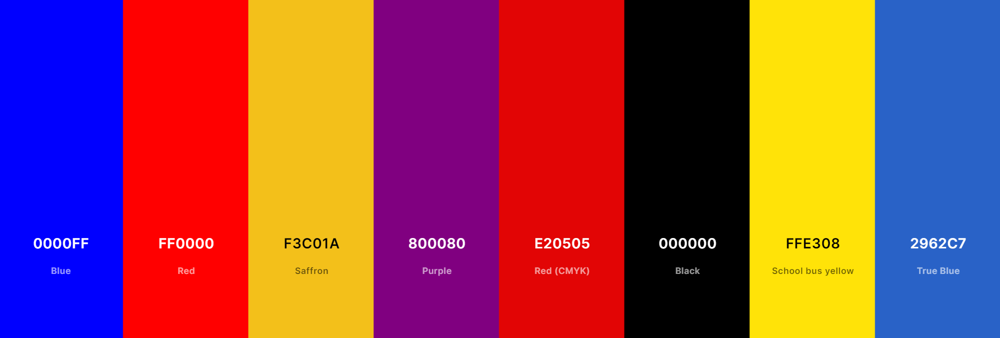

### Balsamiq Wireframes

#### Introduction page

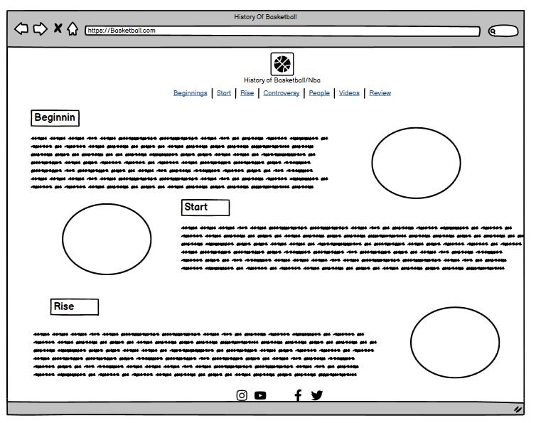

#### Controversey page

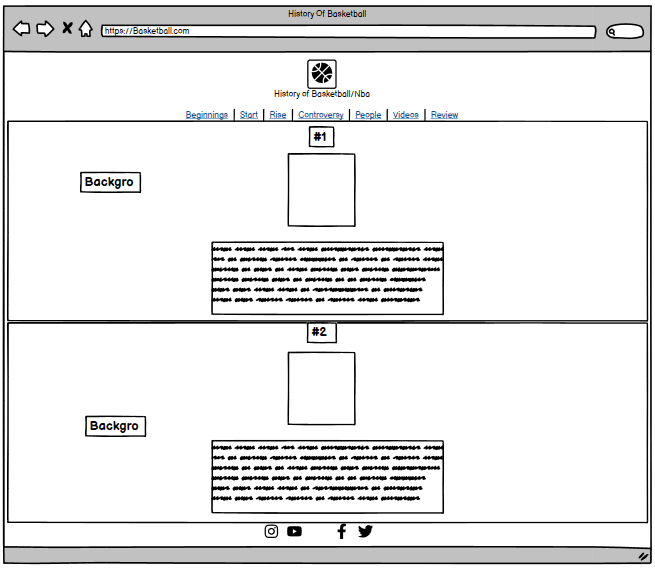

## Testing

- I tested to see if the website would work on Google Chrome, Microsoft Edge, Firefox and using Chrome Dev Tools, simulated different device screen widths and lenghts.

- The website was able to function as intended and that the it was responsive.

- The navigation bar, header, titles and text were all readable and easy to understand.

- The review form works: requires entries in the required field, only accept an email in the email field and submit and rest button works.

### Validator Testing

- HTML
  - No errors were found when passing through the official [(Jigsaw) validator](https://validator.w3.org/).
  
- CSS
  - No errors were found when passing through the official [(Jigsaw) validator](https://jigsaw.w3.org/css-validator/validator).

- Accesibility
  - I can confirm that the colors and fonts are easy to read and accesible by running it through lighthouse in devtools.

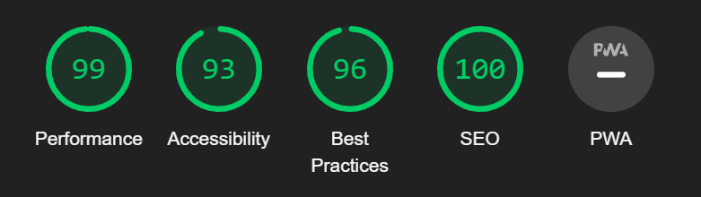

  ## Deployment

  - The site was deployed to GitHub pages. The steps to deploy are as follows: 
  - In the GitHub repository, navigate to the Settings tab 
  - From the source section drop-down menu, select the Master Branch
  - Once the master branch has been selected, the page will be automatically refreshed with a detailed ribbon display to indicate the successful deployment. 

The live link can be found here - https://uloe-g.github.io/History-Of-NBA/

## Credits

### Content

- The code to create the form was taken from [here](https://learn.codeinstitute.net/courses/course-v1:CodeInstitute+LRR101+2021_T1/courseware/9645be8635124d76b35692f1f1f6b753/2c4f82a9ef174830aa83ff2cf10f4bc7/).

- How to embed the Youtube video onto the website was found [here](https://www.youtube.com/watch?v=ly36kn0ug4k&t=86s).

- How I understood file paths was gotten [here](https://learn.codeinstitute.net/courses/course-v1:CodeInstitute+LRR101+2021_T1/courseware/9645be8635124d76b35692f1f1f6b753/493518353382439c9f0d34eba6a4f634/).

### Media

The image in the header was taken from [Vecteezy](https://www.vecteezy.com/).

The image of James Naismith and the people playing basketball was found on the Springfield College [website](https://springfield.edu/where-basketball-was-invented-the-birthplace-of-basketball).

The nba players picture was found [here](https://sports.yahoo.com/77-greatest-nba-players-ever-140126956.html?guccounter=1&guce_referrer=aHR0cHM6Ly93d3cuZ29vZ2xlLmNvbS8&guce_referrer_sig=AQAAACOy1jrvvTn0uL3VrXilZvxbryaF5zpll7IHwP5WLWTdufuszzLX0BwIPXhkw2eZ86Tn1GkgsfgMLFkZUXDSkEu9ql5On8MbIxXGI0ij03J_klJHEPL4DPgqqsc_w0jHaFwYW4YhP8TU92rlBt0PGmEnpP9cGqpOzLtbYf29-UMc).

The image of Donald Sterling was found on the [Time Magazine](https://time.com/107562/donald-sterling-cover-up/). 

The background image was found [here](https://en.wikipedia.org/wiki/Los_Angeles_Clippers).

The David Stern image was found on [IMDb](https://www.imdb.com/name/nm0827668/).

The background behind the dress code section was found on [voaksportswear.com](https://www.voaksportswear.com/).

Gildbert Arenas image was found [here](https://www.nba.com/magic/news/news_arenas_121810.html)

Gilbert Arenas background image was taken from [Marca](https://www.marca.com/en/basketball/nba/washington-wizards/2022/01/07/61d89c6d22601de11e8b45c4.html).

Adam Silver image was found on [penbaypilot.com](https://www.penbaypilot.com/article/adam-silver-perhaps-greatest-commissioner-nba-and-all-sports-history/36113).

Adam silver background image was taken from [CNN](https://edition.cnn.com/2022/11/11/sport/kyrie-irving-adam-silver-meeting-antisemitic-comments-nba-spt/index.html).

Lebron James image was found on [Hoopshype.com](https://hoopshype.com/2024/02/24/lebron-james-on-victor-wembanyama-after-5x5-game-he-has-no-ceiling/).

Lebron James background image was taken from [Fadeawayworld.net](https://fadeawayworld.net/lebron-james-availability-by-percentage-of-games-played-for-each-team-from-95-to-73).

The footer images were obatined as follows:
 
  - Facebook - [Microsoft Store](https://apps.microsoft.com/detail/9wzdncrfj2wl?hl=en-US&gl=US)

  - Instagram - [Wikipedia](https://en.wikipedia.org/wiki/Instagram)

  - X(twitter) - [Business of Apps](https://www.businessofapps.com/news/x-officially-launches-its-ads-revenue-sharing-platform-for-content-creators/)

  - Tiktok - [Pixabay](https://pixabay.com/vectors/tiktok-tiktok-logo-tiktok-button-7002866/)