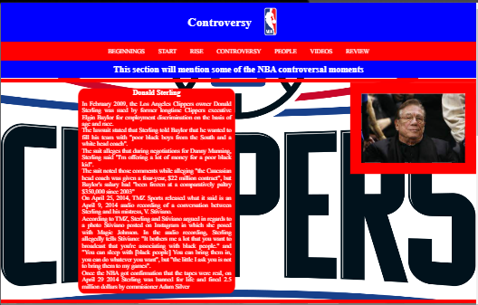

# History of the NBA

History of the NBA is a website for people who are intrested in the NBA. This site specifically mentions the creation of basketball and the creation and rise of the NBA. It also has a section dedicated to people that have impacted the game of basketball.

## Features
This section goes over the different parts of this project. An explaination will be given of what the features provides the user.

### Existing Features
- __Navigation Bar__

  -This is identical on all six pages and includes links to the Beginning, Start, Rise, Players, Video and Review pages.

  -This allows user to easily navigate from page to page, section to section across all devices.

- __Beginnings Section__

  -The beginning section is about the creation of basketball.

  -It mentions who created it, where it was create and why it was created.
  

- __Start Section__
  
  -This section is about the creation of the NBA.

  -It mentions the early days of the NBA and the challenges it faced.

  
- __Rise Section__
  
  -This section discusses the rise of the NBA 
  
  -It talkes about the move and some of the players that helped make the NBA a sustainable leauge.

- __Controversy Section__
  
  -This section talks about some controversial moments that happened in the NBA.

  -It describes what happened and how the NBA or the law solved them

- __People Section__

  -This section shows users the history of som of the NBA most famous and important people.

  -It describes how they got there and the legacies they have achieved

- __Video Section__

  -This section contains videos of moments and people mentioned in the controversy page and people page.

  -It adds extra information on the situations and showcases their talents.

- __Review Section__

  -This section gives the user the ability to critic the webiste after going through it.

  -It allows them to state everything they liked and dislike whilst on this website.

  -It also give them the ability to give there own opinions on how this website can be improved.

![Review]

- __Footer__
  
  -The footer section includes links to various social media platforms the NBA is apart of.

  -This is to give the user easier and quicker access to some of the platforms the NBA is apart of.

## Testing

- I tested to see if the website would work on Google Chrome, Microsoft Edge, Firefox and using Chrome Dev Tools, simulated different device screen widths and lenghts.

- The website was able to function as intended and that the it was responsive.

- The navigation bar, header, titles and text were all readable and easy to understand.

- The review form works: requires entries in the required field, only accept an email in the email field and submit and rest button works.

### Validator Testing

- HTML

- CSS
  - No errors were found when passing through the official [(Jigsaw) validator](https://jigsaw.w3.org/css-validator/validator)

- Accesibility
  - I can confirm that the colors and fonts are easy to read and accesible by running it through lighthouse in devtools.

  ## Deployment

  - The site was deployed to GitHub pages. The steps to deploy are as follows: 
  - In the GitHub repository, navigate to the Settings tab 
  - From the source section drop-down menu, select the Master Branch
  - Once the master branch has been selected, the page will be automatically refreshed with a detailed ribbon display to indicate the successful deployment. 

The live link can be found here - https://uloe-g.github.io/History-Of-NBA/

## Credits

### Content

- The code to create the form was taken from [here](https://learn.codeinstitute.net/courses/course-v1:CodeInstitute+LRR101+2021_T1/courseware/9645be8635124d76b35692f1f1f6b753/2c4f82a9ef174830aa83ff2cf10f4bc7/).

- How to embed the Youtube video onto the website was found [here](https://www.youtube.com/watch?v=ly36kn0ug4k&t=86s).

### Media

The image in the header was taken from [Vecteezy](https://www.vecteezy.com/).